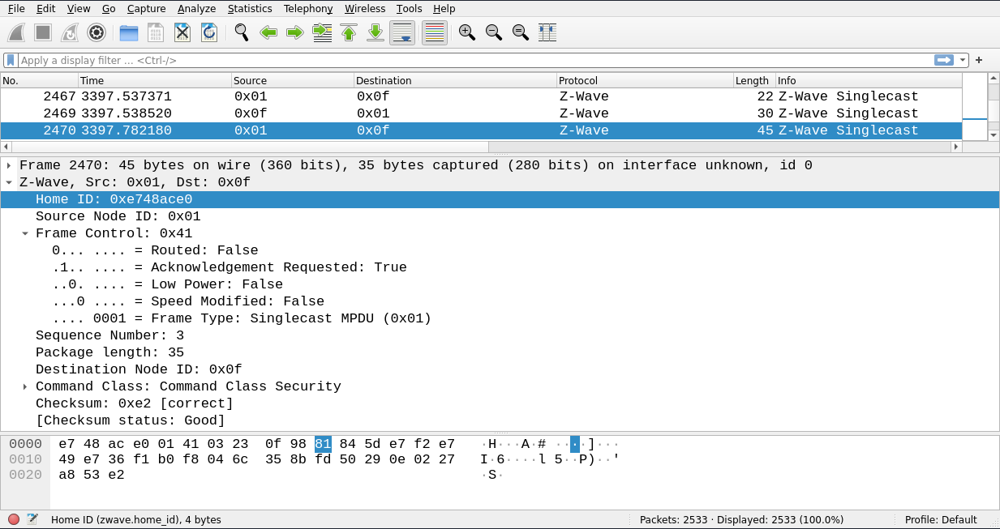
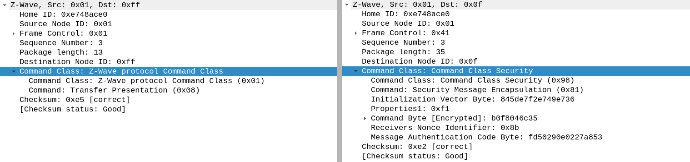
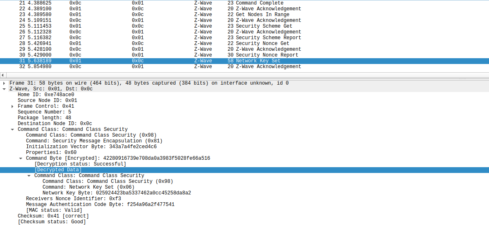

Z-Wave Dissector
----------------

The repositories listed below contain Wireshark with an additional dissector for the Z-Wave protocol, which was developed by KKB:

  - [Z-Wave Dissector](https://github.com/hgb-kkb/ws-zwave-dissector)
  - [Archival Version](https://github.com/hgb-kkb/ws-zwave-dissector-still)

Features include:

  - Interpretation of Z-Wave packet headers
  - Interpretation of Command Classes and associated commands
  - Automatic extraction of SEC0 encryption keys from inclusion packets
  - Decryption of SEC0 encrypted data with extracted and user-defined keys

The main Z-Wave related code can be found in the following paths:

  - epan/dissectors/packet-zwave.{c,h}
  - epan/dissectors/packet-zwave-sec0-decrypt.{c,h}
  - epan/dissectors/packet-zwave-basic.c (Only Archival Version, covers the basic message types)

If you want to try it out, you can find reference .pcap files in the `ref_pcaps` directory. These files contain different message types, including encrypted messages.

Usage Examples
--------------

Interpretation of a Z-Wave pdu:

Interpretation of different Z-Wave commands:

An extracted network key:

